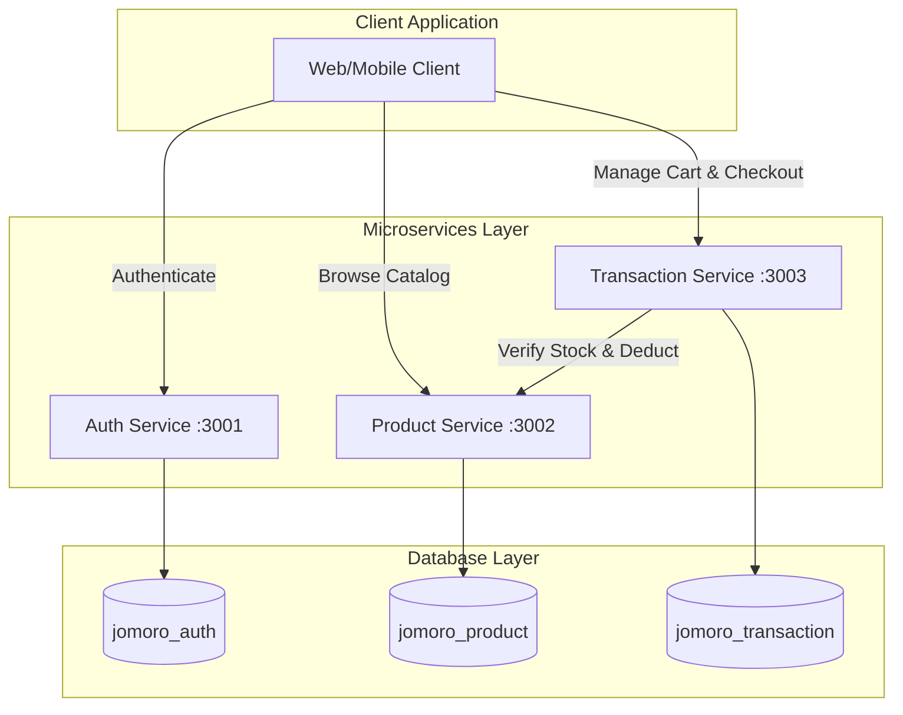

# Jomoro Koffee V2 Backend Microservices

Welcome to the **Jomoro Koffee V2** backend repository. This project is a modern, modular backend system designed using a **Microservices Architecture** with NestJS, Prisma ORM, and MySQL. It is built to efficiently process high-volume online orders, manage catalogs, handle multi-role authorization (Admin/Customer), and automate transactions.

---

## System Architecture

The backend is decomposed into three isolated microservices that communicate via HTTP:



---

## Tech Stack & Technical Constraints

*   **Runtime Environment**: Node.js (v22+)
*   **Framework**: NestJS (v11.x)
*   **Database ORM**: Prisma ORM (v6.19.3)
*   **Database Engine**: MySQL (Local via XAMPP)
*   **Security & Guarding**: Passport JWT stateless verification
*   **Documentation**: Swagger API docs enabled on all services
*   **Constraint (Strict)**: All backend request validations are implemented programmatically **without using Regular Expressions (Regex)**.

---

## Project Structure

```bash
be-system-jomoro-coffe/
├── auth-service/           # Handles user profiles, registration, login (Port 3001)
├── product-service/        # Handles categories, product catalog, and stock (Port 3002)
├── transaction-service/    # Handles carts, orders, and checkout (Port 3003)
└── README.md               # Root System Documentation
```

---

## Setup & Installation

### 1. Prerequisites
Ensure you have **MySQL** running locally (e.g., via XAMPP on port `3306`).

### 2. Database Creation
Create three empty databases in MySQL (phpMyAdmin or terminal):
1.  `jomoro_auth`
2.  `jomoro_product`
3.  `jomoro_transaction`

### 3. Service Configuration & Environment Files
Each service contains a `.env` file containing local configurations. Make sure the connections match your environment:

#### Auth Service (`auth-service/.env`)
```env
DATABASE_URL="mysql://root:@localhost:3306/jomoro_auth"
JWT_SECRET="JomoroKoffeeV2SecretKeyForAuthService"
PORT=3001
```

#### Product Service (`product-service/.env`)
```env
DATABASE_URL="mysql://root:@localhost:3306/jomoro_product"
JWT_SECRET="JomoroKoffeeV2SecretKeyForAuthService"
PORT=3002
```

#### Transaction Service (`transaction-service/.env`)
```env
DATABASE_URL="mysql://root:@localhost:3306/jomoro_transaction"
JWT_SECRET="JomoroKoffeeV2SecretKeyForAuthService"
PRODUCT_SERVICE_URL="http://localhost:3002"
PORT=3003
```

> [!IMPORTANT]
> All three services use a shared `JWT_SECRET` key to ensure stateless JWT signatures created by the **Auth Service** can be verified by the **Product** and **Transaction** services.

### 4. Install Dependencies & Push Databases
For each of the three directories (`auth-service/`, `product-service/`, `transaction-service/`), run:

```bash
npm install
npx prisma db push
```

### 5. Running the Services
Start the development servers for all three projects:

```bash
# In auth-service directory
npm run start:dev

# In product-service directory
npm run start:dev

# In transaction-service directory
npm run start:dev
```

---

## Custom Backend Validations (No-Regex)

Per Requirements Engineering (RE) specifications, all validations are coded strictly using programmatic logic (loops and string checks) to prevent Regex vulnerabilities:

1.  **First & Last Name**: Must contain only alphabetic characters (`A-Za-z`). Checked via code loops verifying character codes.
2.  **Email Extension**: Must end with `.com`, `.net`, `.org`, or `.id`. Checked using string ending matches.
3.  **Password Strength**: Minimum 8 characters, contains no spaces, and has at least 2 numeric digits. Checked using char-by-char iteration.
4.  **Product Name**: Must contain at least 3 words. Checked by splitting the name by spaces and filtering empty indices.
5.  **Product Description**: Must be at least 20 characters long.
6.  **Product Price & Stock**: Handled as valid numbers. Stock ranges from `0` to `999`. Price must be a positive integer `>= 1`.

---

## API Documentation & Endpoints

### 1. Auth Service (Port `3001`)
Access Swagger Docs at: [http://localhost:3001/api](http://localhost:3001/api)

| Endpoint | Method | Role | Description |
| :--- | :---: | :---: | :--- |
| `/auth/register` | `POST` | Public | Register a new user (role: `Admin` or `Customer`). |
| `/auth/login` | `POST` | Public | Authenticate credentials and return a Bearer JWT token. |
| `/profiles` | `GET` | Authenticated | Fetch details of the currently logged-in user profile. |

---

### 2. Product Service (Port `3002`)
Access Swagger Docs at: [http://localhost:3002/api](http://localhost:3002/api)

| Endpoint | Method | Role | Description |
| :--- | :---: | :---: | :--- |
| `/products` | `GET` | Public | List all active coffee/accessory products. |
| `/products/:id` | `GET` | Public | Fetch detailed information of a single product. |
| `/categories` | `GET` | Public | List all product menu categories. |
| `/categories/:categoryId/products` | `GET` | Public | Filter products by category ID. |
| `/admin/products` | `POST` | Admin | Create a new product. |
| `/admin/products/:id/update` | `POST` | Admin | Update product details. |
| `/admin/products/:id/delete` | `POST` | Admin | Remove a product. |
| `/admin/products/:id/reduce` | `POST` | Authenticated | Decrement product stock level (used internally during checkout). |

---

### 3. Transaction Service (Port `3003`)
Access Swagger Docs at: [http://localhost:3003/api](http://localhost:3003/api)

| Endpoint | Method | Role | Description |
| :--- | :---: | :---: | :--- |
| `/cart` | `GET` | Customer | Fetch the customer's active cart with product names and prices. |
| `/cart` | `POST` | Customer | Add a product to the cart (checks stock availability). |
| `/cart/:product_id/update` | `POST` | Customer | Modify item quantity in the cart. |
| `/cart/:product_id/delete` | `POST` | Customer | Remove a specific item from the cart. |
| `/cart/clear` | `POST` | Customer | Empty all items from the cart. |
| `/orders` | `GET` | Customer | Fetch the logged-in customer's order history. |
| `/orders/:id` | `POST` | Customer | Fetch details of a specific past order. |
| `/orders` | `POST` | Customer | Checkout: creates order, locks prices, reduces product stock, clears cart. |

---

## Integration Testing Flow

To test the system E2E, execute the following steps in order using Swagger or Postman:

1.  **Register Users**:
    *   Create an Admin Account (`POST http://localhost:3001/auth/register` with role `Admin`).
    *   Create a Customer Account (`POST http://localhost:3001/auth/register` with role `Customer`).
2.  **Add a Category**:
    *   Initialize categories directly inside your `jomoro_product` MySQL database table (e.g. ID `1`, Name `test`).
3.  **Insert a Product**:
    *   Log in as Admin (`POST http://localhost:3001/auth/login`) to receive the JWT token.
    *   Use the Admin JWT token to create a product (`POST http://localhost:3002/admin/products`, stock: `100`).
4.  **Manage Cart**:
    *   Log in as Customer (`POST http://localhost:3001/auth/login`) to receive the Customer JWT token.
    *   Add the product to your cart (`POST http://localhost:3003/cart`).
    *   Fetch cart (`GET http://localhost:3003/cart`) to check details.
5.  **Checkout**:
    *   Execute checkout (`POST http://localhost:3003/orders`).
    *   Check the Product Service (`GET http://localhost:3002/products/:id`) to verify the stock level was automatically decremented.
