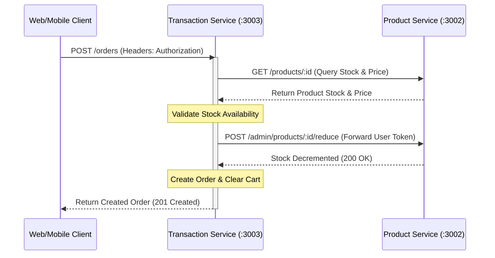

# Jomoro Koffee V2 — Transaction Service

The **Transaction Service** handles customer shopping cart states, order history, and checkouts. Running on port `3003`, it restricts access to customers, verifies real-time catalog prices and stock levels via cross-service API requests, and automates stock reduction in the product service when checkouts succeed.

---

## Table of Contents
1. [Architectural Role](#architectural-role)
2. [Cross-Service Orchestration](#cross-service-orchestration)
3. [Environment Configuration](#environment-configuration)
4. [Database Schema](#database-schema)
5. [API Endpoint Contract](#api-endpoint-contract)
6. [Codebase Tour](#codebase-tour)
7. [Running & Development Scripts](#running--development-scripts)

---

## Architectural Role

The Transaction Service manages the following functions:
* **Cart & Order Ledger**: Connects to the isolated `jomoro_transaction` MySQL database to track temporary carts and persistent order histories.
* **Customer Isolation**: Protects all paths using both `JwtAuthGuard` and a custom `CustomerGuard`, ensuring only users with the `Customer` role can modify carts or place orders.
* **Price & Stock Synchronization**: Rather than duplicating product details, it queries the product catalog dynamically to verify availability and lock in price snapshots during transactions.

---

## Cross-Service Orchestration

The transaction service interacts with the `product-service` via HTTP requests using `@nestjs/axios` (Axios wrapper).



1. **Verify Stock & Fetch Names**: When fetching the cart or checking out, the service calls `GET /products/:id` on the Product Service to retrieve the product's name, price, and current stock level.
2. **Forwarded Bearer JWT Authorization**: During checkout (`POST /orders`), the service forwards the client's original `Authorization` header token to the Product Service at `POST /admin/products/:id/reduce`. This enables the Product Service to verify that the request comes from an authenticated user without exposing the stock reduction endpoint publicly.

---

## Environment Configuration

Create a `.env` file in the root of the `transaction-service` directory:

```env
DATABASE_URL="mysql://root:@localhost:3306/jomoro_transaction"
JWT_SECRET="JomoroKoffeeV2SecretKeyForAuthService"
PRODUCT_SERVICE_URL="http://localhost:3002"
PORT=3003
```

* **DATABASE_URL**: The connection URL for the `jomoro_transaction` MySQL schema.
* **JWT_SECRET**: **Must match the JWT secret key of the Auth Service**. Restricts route access to validated sessions.
* **PRODUCT_SERVICE_URL**: The base URL pointing to the active Product Service instance.
* **PORT**: The network port this microservice binds to. Defaults to `3003`.

---

## Database Schema

The database models are defined via Prisma in [schema.prisma](file:///d:/Finpro%20lab%20SA/be-system-jomoro-coffe/transaction-service/prisma/schema.prisma):

```prisma
model Cart {
  id      Int        @id @default(autoincrement()) @unique
  user_id Int        @unique
  items   CartItem[]

  @@map("carts")
}

model CartItem {
  id         Int  @id @default(autoincrement()) @unique
  cart_id    Int
  product_id Int
  quantity   Int
  cart       Cart @relation(fields: [cart_id], references: [id], onDelete: Cascade)

  @@map("cart_items")
}

model Order {
  id         Int           @id @default(autoincrement()) @unique
  user_id    Int
  created_at DateTime      @default(now())
  details    OrderDetail[]

  @@map("orders")
}

model OrderDetail {
  id         Int   @id @default(autoincrement()) @unique
  order_id   Int
  product_id Int
  price      Float
  quantity   Int
  order      Order @relation(fields: [order_id], references: [id], onDelete: Cascade)

  @@map("order_details")
}
```

### Table Properties: `carts`
* Tracks the shopping cart for each unique user (`user_id`).

### Table Properties: `cart_items`
* `cart_id`: References the parent cart.
* `product_id`: Links to the item's ID in the Product Service database.
* `quantity`: The quantity added to the cart.

### Table Properties: `orders`
* Represents a finalized transaction. Tracks the checkout timestamp (`created_at`) and the buying user (`user_id`).

### Table Properties: `order_details`
* Stores snapshots of the item details at checkout.
* `price`: The price lock-in value (protects from catalog updates after purchase).
* `quantity`: The quantity purchased.

---

## API Endpoint Contract

All endpoints in this service are guarded by `JwtAuthGuard` and `CustomerGuard` (requires header: `Authorization: Bearer <token>` where user role is `Customer`). Access the Swagger docs at [http://localhost:3003/api](http://localhost:3003/api).

### 1. Cart Management Endpoints
* **Get Cart Items**: `GET /cart`
  * Returns active items with aggregated subtotal prices, product names fetched from Product Service, and the cart total.
* **Add Item**: `POST /cart`
  * Request Body (`AddToCartDto`):
    ```json
    {
      "product_id": 1,
      "quantity": 2
    }
    ```
  * Responses: `201 Created` on success, `400 Bad Request` if stock is exceeded, or if the product is already in the cart.
* **Update Quantity**: `POST /cart/:product_id/update`
  * Request Body (`UpdateCartItemDto`):
    ```json
    {
      "quantity": 3
    }
    ```
  * Responses: `200 OK` on success, `400 Bad Request` if new quantity exceeds stock.
* **Delete Item**: `POST /cart/:product_id/delete`
  * Removes the specific product from the cart.
* **Clear Cart**: `POST /cart/clear`
  * Empties all items in the customer's active cart.

### 2. Checkout & Order History Endpoints
* **Checkout Cart**: `POST /orders`
  * **Function**: Creates a new order ledger, snapshots prices, calls Product Service to decrement inventory stock levels, and clears the cart database.
  * Responses:
    * `201 Created`: Returns details of the created order.
    * `400 Bad Request`: Cart is empty or product stock has run out since addition.
* **Get Orders**: `GET /orders`
  * Returns the user's complete order history (most recent orders first).
* **Get Order Details**: `POST /orders/:id`
  * Returns details of a specific past order, including item names, prices, and totals.
  * Responses: `200 OK`, `400 Bad Request` (if user does not own the order), `404 Not Found` (if order does not exist).

---

## Codebase Tour

Below is a map of the file layout inside `/src` and their primary functions:

* [main.ts](file:///d:/Finpro%20lab%20SA/be-system-jomoro-coffe/transaction-service/src/main.ts): Instantiates the service, sets up CORS settings, binds Swagger UI documentation, and launches port `3003`.
* [app.module.ts](file:///d:/Finpro%20lab%20SA/be-system-jomoro-coffe/transaction-service/src/app.module.ts): The root module, binding database connectors, controllers, service functions, JWT Passport configurations, and importing `HttpModule` for cross-service API requests.
* [app.controller.ts](file:///d:/Finpro%20lab%20SA/be-system-jomoro-coffe/transaction-service/src/app.controller.ts): Declares endpoints, maps routes, and registers the global controller guards (`JwtAuthGuard` and `CustomerGuard`).
* [app.service.ts](file:///d:/Finpro%20lab%20SA/be-system-jomoro-coffe/transaction-service/src/app.service.ts): Core transaction logic: fetches catalogs, makes cross-service Axios HTTP calls, validates quantities, processes orders, and manages cart transactions.
* [prisma.service.ts](file:///d:/Finpro%20lab%20SA/be-system-jomoro-coffe/transaction-service/src/prisma.service.ts): Handles lifecycle connections to the database using Prisma.
* [customer.guard.ts](file:///d:/Finpro%20lab%20SA/be-system-jomoro-coffe/transaction-service/src/customer.guard.ts): Protects routes from access by non-customer accounts.
* [jwt-auth-guard.ts](file:///d:/Finpro%20lab%20SA/be-system-jomoro-coffe/transaction-service/src/jwt-auth-guard.ts): Restricts routes to authenticated sessions.
* [jwt.strategy.ts](file:///d:/Finpro%20lab%20SA/be-system-jomoro-coffe/transaction-service/src/jwt.strategy.ts): Validates client token signatures against the shared `JWT_SECRET` key.
* [transaction.dto.ts](file:///d:/Finpro%20lab%20SA/be-system-jomoro-coffe/transaction-service/src/transaction.dto.ts): Defines types and validation schemas for cart addition and cart update requests.

---

## Running & Development Scripts

Ensure you run `npm install` and verify the database schema is pushed (`npx prisma db push`) before starting.

```bash
# Run compiling development server with hot-reload
$ npm run start:dev

# Build files into statically optimized build outputs (/dist)
$ npm run build

# Start production server compiled output
$ npm run start:prod

# Format source files using Prettier standards
$ npm run format

# Run ESLint linter check
$ npm run lint
```
